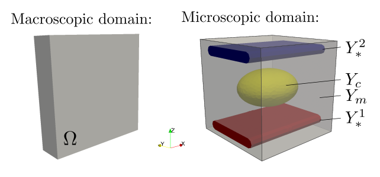
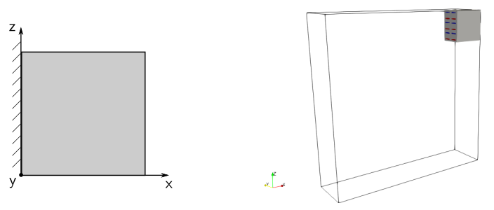
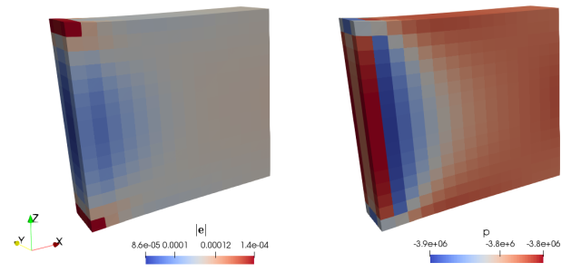
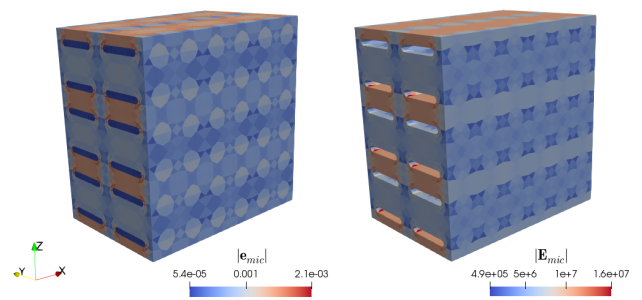

.. poropiezo_example documentation master file, created by
   sphinx-quickstart on Thu Mar 12 09:03:54 2020.
   You can adapt this file completely to your liking, but it should at least
   contain the root `toctree` directive.

.. Welcome to poropiezo_example's documentation!
.. =============================================

.. toctree::
   :maxdepth: 2
   :caption: Contents:

Numerical simulation of fluid-saturated piezoelectric porous media
==================================================================

Mathematical model
------------------

We consider a porous piezoelectric medium which consists of a piezoelectric
matrix, embedded metallic electrodes (conductors) and fluid-filled inclusions.
These components are arranged in a periodic lattice so that the medium can be
generated by copies of the reference unit cell, see :numref:`fig_domains`.
The mechanical behavior of such a structure can be described using the
two-scale asymptotic homogenization method, see [RohanLukes2018]_.

The mechanical properties of the piezoelectric solid are given by the following
constitutive equations

.. math::
   :label: eq-constitutive

   \sigma^\veps_{ij}(\ub^\veps,\vphi^\veps) & = A_{ijkl}^\veps e_{kl}(\ub^\veps) - g_{kij}^\veps E_k(\vphi^\veps), \\
   D_k^\veps(\ub^\veps,\vphi^\veps) &= g_{kij}^\veps e_{ij}(\ub^\veps) + d_{kl}^\veps E_l(\vphi^\veps),

where :math:`\sigmab^\veps` is the Cauchy stress tensor, :math:`\vec{D}^\veps`
is the electric displacement, :math:`\eb(\ub^\veps) =
{1\over2}\left(\nabla\ub^\veps + (\nabla\ub^\veps)^T\right)` is the strain
tensor, :math:`\ub^\veps` is the displacement field,
:math:`\vec{E}(\vphi^\veps) = \nabla \vphi^\veps` is the electric field and
:math:`\vphi^\veps` is the electric potential. On the right hand side of
:eq:`eq-constitutive`, we have the fourth-order elastic tensor
:math:`A^\veps_{ijkl}` (:math:`A^\veps_{ijkl} = A^\veps_{klij} =
A^\veps_{jilk}`), the third-order tensor :math:`g^\veps_{kij}`
(:math:`g^\veps_{kij} = g^\veps_{kji}`), which couples mechanical and electric
quantities, and the permeability tensor :math:`d^\veps_{kl}`.
The superscript :math:`{}^\veps` denotes the quantities oscillating within the heterogeneous
structure with the period equal to the size of the periodic unit.

The quasi-static problem of the piezoelectric medium is given by the following
equilibrium equations

.. math::
   :label: eq-equilibrium

   -\nabla\cdot \sigmab^\veps(\ub^\veps,\vphi^\veps) & = \fb^\veps, \quad \mbox{ in } \Om_{m*}^\veps, \\
   -\nabla\cdot \vec D^\veps(\ub^\veps,\vphi^\veps) & = q_E^\veps,\quad \mbox{ in } \Om_m^\veps,

end by the mass conservation equation for the *k* th fluid inclusion occupying
domain :math:`\Om_c^{k,\veps}`

.. math::
   :label: eq-compressibility

   \int_{\partial \Om_{k,\veps}} {\ub^\veps}\cdot \nb \dS + \gamma p^{k,\veps} |\Om_c^{k,\veps}|= 0, \quad \forall k \in \{1,\dots,\bar k^\veps\}.

where :math:`p^{k,\veps}` is the inclusion pressure and :math:`\gamma` is the
fluid compressibility.

Two-scale homogenization
------------------------

.. _fig_domains:

   Macroscopic domain :math:`\Omega` and decomposition of microscopic domain :math:`Y`

We apply the standard homogenization techniques to the above problem. It
results in the limit model for :math:`\veps \longrightarrow 0`, where
:math:`\veps` is the scale parameter relating the microscopic and macroscopic
length scales. The homogenization process leads to local microscopic problems,
defined within a reference periodic cell, and to the global problem describing
the behavior of the homogenized medium at the macroscopic level. The global
problem involves the homogenized material coefficients which are evaluated
using the solutions of the local problems. Due to linearity of the problem, the
microscopic and macroscopic problems are decoupled.

As we assume given potentials :math:`\bar\vphi^k` in each of the electrode networks,
the dielectric properties must be appropriately rescaled in order to preserve
the finite electric field in the limit:

.. math::
   :label: eq-rescaled

   \gb^\veps = \veps \bar\gb,\\
   \db^\veps = \veps^2 \bar\db.

The local microscopic responses of the piezoelectric structure are given by the
following sub-problems which are solved within the periodic reference cell :math:`Y`,
see :numref:`fig_domains`, that is decomposed similarly to the decomposition of
domain :math:`\Omega`:

- Find :math:`\omegab^{ij}`, :math:`\eta^{ij}` such that for all :math:`\vb`, :math:`\psi`
  and for any :math:`i, j = 1, 2, 3`

.. math::
   :label: eq-corrs1

   \int_{Y_{m*}} \left[\Ab \eeb{\omegab^{ij} + \Pib^{ij}}\right]: \eeb{\vb}\,\dV  - \int_{Y_m} \left[\bar\gb^T\cdot\nabla \eta^{ij}\right]: \eeb{\vb} \, \dV &= 0, \\
   \int_{Y_m} \left[\bar\gb:\eeb{\omegab^{ij} + \Pib^{ij}} + \bar\db \cdot\nabla \eta^{ij}\right]\cdot\nabla\psi \, \dV &= 0,

where :math:`\Pi^{ij}_k = y_j \delta_{ik}`.

- Find :math:`\omegab^P`, :math:`\eta^P` such that for all :math:`\vb`,
  :math:`\psi` satisfying

.. math::
   :label: eq-corrs2

   \int_{Y_{m*}} \left[\Ab \eeb{\omegab^P}\right]: \eeb{\vb}\,\dV - \int_{Y_m} \left[\bar\gb^T\cdot\nabla \eta^P\right]: \eeb{\vb} \,\dV &= -{1\over \vert Y\vert}\int_{\Gamma_c} \vb \cdot \nb\, \dS , \\
   \int_{Y_m} \left[\bar\gb:\eeb{\omegab^P} + \bar\db \cdot\nabla \eta^P\right]\cdot\nabla\psi \,\dV &= 0.

- Find :math:`\omegab^\rho`, :math:`\eta^\rho` such that for all :math:`\vb`,
  :math:`\psi` satisfying

.. math::
   :label: eq-corrs3

   \int_{Y_{m*}} \left[\Ab \eeb{\omegab^\rho}\right]: \eeb{\vb}\,\dV - \int_{Y_m} \left[\bar\gb^T\cdot\nabla \eta^\rho\right]: \eeb{\vb} \,\dV &= 0 , \\
   \int_{Y_m} \left[\bar\gb:\eeb{\omegab^\rho} + \bar\db \cdot\nabla \eta^\rho\right]\cdot\nabla\psi \,\dV &= -{1\over \vert Y\vert}\int_{\Gamma_{m*}} \psi\, \dS.

- Find :math:`\hat\omegab^k`, :math:`\hat\eta^k` such that for all :math:`\vb`,
  :math:`\psi` and for any :math:`k = 1, 2, \dots, k^c` (:math:`k^c` is the number of conductors)

.. math::
   :label: eq-corrs4

   \int_{Y_{m*}} \left[\Ab \eeb{\hat\omegab^{k}}\right]: \eeb{\vb}\,\dV - \int_{Y_m} \left[\bar\gb^T\cdot\nabla \hat\eta^k\right]: \eeb{\vb} \,\dV &= 0, \\
   \int_{Y_m} \left[\bar\gb:\eeb{\hat\omegab^k} + \bar\db \cdot\nabla \hat\eta^k\right]\cdot\nabla\psi \,\dV &= 0.

The microscopic sub-problems are solved with the periodic boundary conditions
and :math:`\hat\eta^k = \delta_{ki}` on :math:`\Gamma^i_{m*}` for :math:`i = 1, 2, \dots, k^c`,
:math:`\Gamma^i_{m*} = \overline{Y_m} \cap \overline{Y_c^i}` is the interface between
the matrix part :math:`Y_m` and :math:`i`-th conductor :math:`Y_c^i`.
Functions :math:`\eta^{ij}`,  :math:`\eta^P` and :math:`\eta^\rho`
are equal to zero on :math:`\Gamma_{m*}`.

With the characteristic responses obtained by solving local sub-problems,
the homogenized material coefficients :math:`\Ab^H`, :math:`\Bb^H`, :math:`\Hb^{H,k}`, :math:`M^H` and  :math:`Z^{H,k}` can be evaluated
using the following expressions:

.. math::
   :label: eq-coefs

   A_{ijkl}^H & = {1\over \vert Y\vert} \left[\int_{Y_{m*}} \left[\Ab \eeb{\omegab^{ij} + \Pib^{ij}}\right]: \eeb{\omegab^{kl} + \Pib^{kl}}\,\dV
      + \int_{Y_m} \bar\db \nabla\eta^{ij} \cdot\nabla\eta^{kl}\,\dV\right],\\
   B_{ijkl}^H & = {1\over \vert Y\vert} \left[\int_{Y_{m*}} \left[\Ab \eeb{\omega^{P}}\right]: \eeb{\Pib^{kl}}\,\dV
      - \int_{Y_m} \bar\gb \nabla \Pib^{ij} \cdot\nabla\eta^{P}\,\dV\right] + \Phi \delta_{ij},\\
   H^{H,k}_{ij} & = {1\over \vert Y\vert} \left[\int_{Y_{m*}} \left[\Ab \eeb{\hat\omegab^k}\right]: \eeb{\Pib^{ij}}\,\dV
      - \int_{Y_m} \left[\bar\gb:\eeb{\Pib^{ij}}\right]\cdot\nabla\hat\eta^k\,\dV\right],\\
   M^H & = {1\over \vert Y\vert} \left[\int_{Y_{m*}} \left[\Ab \eeb{\omega^{P}}\right]: \eeb{\omega^{P}}\,\dV
      + \int_{Y_m} \bar\db \nabla\eta^{P} \cdot\nabla\eta^{P}\,\dV\right] + \Phi \delta_{ij},\\
   Z^{H,k} &= -{1\over \vert Y\vert}\int_{\Gamma_c} \hat\omega^k \cdot \nb\, \dS

The global macroscopic problem is defined in terms of the homogenized
coefficients as: Find the macroscopic displacements :math:`\ub^0` and
:math:`p^0` such that for all :math:`\vb^0` and :math:`q^0`

.. math::
   :label: eq-macro

   \int_{\Omega} [\Ab^H \eeb{\ub^0} - p^0 \Bb^H]: \eeb{\vb}\,\dV
      &= - \int_{\Omega} \eeb{\vb} : \sum\limits_k \Hb^{H,k} \bar\vphi^k \,\dV
      + \int_{\Omega} f \cdot \vb \dV,\\
   \int_{\Omega} q^0(\Bb^H:\eeb{\ub^0} + p^0 M^H) \dV
      &= \int_{\Omega} q^0 \sum\limits_k Z^{H,k} \bar\vphi^k \,\dV.

We assumed that the volume electric charge is equal to zero, otherwise we would
need extra coefficients and right hand side terms.

Numerical simulation
--------------------

To run the numerical simulation, download the
`archive <https://github.com/vlukes/example_poropiezo/archive/v1.zip>`_,
unpack it in the main SfePy directory and type:

.. code::

   ./simple.py example_poropiezo-1/poropiezo_macro_dfc.py

This invoke the :code:`simply.py` script which calculates the macroscopic
problem :eq:`eq-macro` and calls the homogenization engine that solves the
local subproblems :eq:`eq-corrs1`--:eq:`eq-corrs2`, evaluates the homogenized
coefficients :eq:`eq-coefs` and finally performs the reconstruction of the
solutions at the microscopic level. See [CimrmanLukesRohan2019]_ for more details related
to the SfePy homogenization engine.

The macroscopic sample is fixed on its left side, so that no displacements are
allowed, see :numref:`fig_bc_rec` left. The defromation is induced due to piezoelectric
effect, as the responce to the prescribed electric potentials
:math:`\bar\vphi^1`, :math:`\bar\vphi^2`, see :eq:`eq-macro`.

.. _fig_bc_rec:

   Left - boundary conditions applied at the macroscopic level; right - revocered part of the macroscopic sample

The deformed shape of the sample, pressure field :math:`p` and the magnitude of
macroscopic strain :math:`\eb(\ub^0)` are depicted in
:numref:`fig_macro_results`. The reconstructed strain and electric fields for a
given :math:`\veps^0` in the part of the macroscopic domain are shown in
:numref:`fig_recovered_results`.

.. _fig_macro_results:

   Deformed macroscopic sample and the resulting fields: left - pressure
   :math:`p`; right - magnitude of macroscopic strain :math:`\eb`

.. _fig_recovered_results:

   Magnitudes of reconstructed fields: left - strain field :math:`\eb^{mic}`;
   right - electric field :math:`\vec{E}^{mic}`

References
----------

.. [RohanLukes2018] Rohan E., Lukeš V. Homogenization of the fluid-saturated piezoelectric porous media.
   International Journal of Solids and Structures, 147:110-120, 2018,
   `DOI:10.1016/j.ijsolstr.2018.05.017 <https://doi.org/10.1016/j.ijsolstr.2018.05.017>`_
.. [CimrmanLukesRohan2019] Cimrman R., Lukeš V., Rohan E.
   Multiscale finite element calculations in Python using SfePy.
   Advances in Computational Mathematics, 45(4):1897-1921, 2019,
   `DOI:10.1007/s10444-019-09666-0 <https://doi.org/10.1007/s10444-019-09666-0>`_

